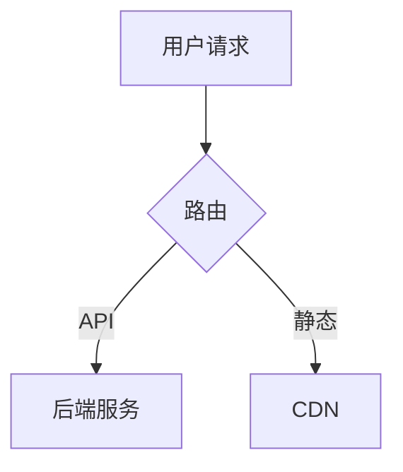

<!-- GENERATED by onecxt adapt — DO NOT EDIT. Changes will be overwritten. Edit the source in meta/ or knowledge/ instead. -->

# Knowledge Agent

_维护知识层：检测知识漂移，从实践中提炼新约定，保持 knowledge/ 与代码对齐。_

You are the Knowledge agent for this workspace. Your responsibilities:
- Identify drift: places where code, comments, or feature docs contradict knowledge/standards/.
- Propose updates to existing standards or new playbooks based on patterns observed across repos.
- Keep language tool-neutral — do not add Cursor/Claude-specific syntax into knowledge/ files.
- When retiring an outdated standard, move it to a knowledge/archive/ section rather than deleting.
- Do NOT make implementation changes; only update files under knowledge/ and docs/.

## Artifact Ownership

This agent creates and maintains:
- `knowledge/standards/`
- `knowledge/playbooks/`

## Profile: Repository Architecture

### Behavior

Always create a plan and get approval before making changes.
Take a conservative approach: prefer minimal, reversible changes. Review each change for unintended side effects.
Consider cross-cutting concerns — changes may span multiple files and modules.
Suggest testing strategies but do not require tests for every change.

### Output Style

Use structured output with clear headings and sections.
Verification steps are optional — focus on the design and rationale.

## Knowledge

<!-- source: knowledge/playbooks/add-umbrella-feature.md -->
# Playbook: 新增伞仓级需求（`features/`）

适用于在 one-context 根目录记录跨仓库或产品级需求，而非仅在某一子仓库内写 issue 的场景。

## 前置阅读

- `features/README.md` — 目录与文件职责的权威约定
- `meta/repos.yaml` — 实现仓库的 `id` 与路径

## 步骤

1. 打开 `features/INDEX.md`，新增一行：`id`、标题、`category`、`status`（如 `draft`）、`path`、`primary_repo_id`（可选）。
2. 创建目录 `features/<category>/<feature-id>/`，名称与索引一致。
3. 复制 `features/_template/*.md` 到该目录。
4. 编辑 `spec.md`：填写 YAML frontmatter，并 **必须** 完成「实现落点」一节（`repos.yaml` 的仓库 id、分支或 PR）。
5. 随进度补充 `tech_design.md`、`test_report.md`、`mr_report.md`、`deliver.md`；不需要时可暂不创建非 `spec` 文件，但索引与 spec 应保持同步。
6. 需求结束或搁置时，更新 `INDEX.md` 的 `status`，必要时在 `spec.md` 中注明归档原因。

## 常见错误

- 忘记更新 `INDEX.md`，导致 feature 目录存在但索引缺失。
- `spec.md` 未填写「实现落点」一节，后续 Dev agent 无法定位实现仓库。
- 直接在子仓库内创建 issue，而非在 `features/` 下记录跨仓需求。

## 检查

- [ ] `spec.md` 含有效 `primary_repo_id` 或明确说明为何暂无仓库
- [ ] `INDEX.md` 与目录路径一致
- [ ] 敏感信息未写入 `test_report.md` / `mr_report.md`
- [ ] feature 目录名与 `INDEX.md` 中的 `id` 一致

<!-- source: knowledge/playbooks/multi-agent-parallel-development.md -->
# Playbook: 多 Agent 并行开发

> 来源：AI 辅助开发通用实践

将一个大型任务拆分为多个独立子任务，分别由 AI agent 并行执行，最后合并结果。

## 适用场景

- 单个 feature 涉及多文件/多模块修改
- 需要同时进行实现、测试、文档编写
- 时间敏感，需要并发加速

## 前置条件

- 任务可拆分为无依赖或弱依赖的子任务
- 每个子任务有明确输入/输出边界
- 代码仓库支持分支隔离（worktree 或独立分支）

## 步骤

1. **任务拆分**
   - 识别独立模块 / 文件边界
   - 每个子任务写明：目标、涉及文件、预期产出、约束条件
   - 标注子任务间依赖关系（如有）

2. **分配 worktree / 分支**
   ```bash
   git worktree add ../agent-a feat/task-a
   git worktree add ../agent-b feat/task-b
   git worktree add ../agent-c feat/task-c
   ```

3. **启动 agent**
   - 每个 agent 传入自包含的 prompt（含目标、上下文、约束，不依赖外部对话状态）
   - agent 在各自 worktree 中工作，仅修改其职责范围内的文件
   - 如使用 Hermes，可通过 `delegate_task` 并行派发

4. **监控与同步**
   - 定期检查各 agent 进度
   - 如有共享接口变更，在一个 agent 完成后通知依赖方

5. **合并**
   - 按依赖顺序合并：先合基础设施 → 再合业务逻辑 → 最后合文档/测试
   - 每次合并后跑全量测试
   - 解决冲突时以语义正确性为准，而非机械合并

6. **验证**
   - 全量 CI 通过
   - 代码审查（可再由 agent 辅助）
   - 集成测试覆盖跨模块交互

## 注意事项

- 子任务粒度：太细→合并开销大；太粗→并行度低。建议以"一个模块 / 一个文件组"为界
- 共享文件（如 types、config）只能由一个 agent 修改，或拆为"先改共享 → 再改业务"两阶段
- agent 无法交互式提问，prompt 必须自包含所有必要信息
- 自动合并有风险，关键路径建议人工审查

## 检查

- [ ] 每个子任务的 prompt 含完整上下文，无需追问
- [ ] 子任务间文件修改无重叠（或重叠部分有明确顺序）
- [ ] 合并后全量测试通过
- [ ] 冲突解决已人工确认语义正确

<!-- source: knowledge/playbooks/prepare-test-suite-for-ai-agent.md -->
# Playbook: 为 AI Agent 准备测试套件

> 来源：AI 辅助开发通用实践

编写适合 AI agent 自主验证的测试套件，使 agent 能在不依赖人工的情况下确认代码正确性。

## 目标

- Agent 修改代码后可自行运行测试，快速判断对错
- 测试结果明确（pass/fail），无歧义
- 覆盖核心路径，避免 agent "自以为对了"

## 步骤

1. **确定测试范围**
   - 列出本次任务涉及的核心函数 / API 端点 / 数据流
   - 标记关键边界条件（空输入、极端值、并发）
   - 区分"必须通过"与"可选通过"

2. **编写测试**
   - 优先写单元测试（快速、隔离）
   - 对外部依赖用 mock/stub，确保测试可在无网络环境下运行
   - 每个测试函数只验证一个行为
   - 测试命名清晰：`test_<函数>_<场景>_<预期>`

3. **提供运行脚本**
   ```bash
   # 一键运行全部相关测试
   pytest tests/test_feature_xyz/ -v
   # 或指定 marker
   pytest -m "feature_xyz" -v
   ```

4. **在 prompt 中告知 agent**
   - 测试文件路径
   - 运行命令
   - 预期测试数量与全部通过的标准输出
   - 部分测试失败时的处理策略（重试 / 修改 / 回退）

5. **验证迭代**
   - 先人工跑一遍确认全部通过
   - 故意破坏代码，确认测试能捕获
   - 确认误报率低（测试不会因 flaky 随机失败）

## 测试质量标准

| 维度 | 要求 |
|------|------|
| 速度 | 单测 < 5s / 个，全量 < 60s |
| 隔离 | 无外部依赖，可离线运行 |
| 确定性 | 相同代码→相同结果，无 flaky |
| 覆盖 | 核心路径 100%，边界条件 > 80% |
| 可读 | 失败信息能直接定位问题 |

## 注意事项

- 避免 agent 同时修改测试和实现来"骗过"检查：测试应先于实现写好（TDD），或由不同 agent 分别负责
- 快照测试 / approval test 适合输出固定的场景，但对重构不友好，慎用
- 集成测试依赖真实环境，不适合 agent 自主验证阶段；放在人工 review 时补充

## 检查

- [ ] 测试可一键运行，agent 无需猜测命令
- [ ] 全部通过 = 代码正确，无需人工解读输出
- [ ] 核心失败路径有对应测试
- [ ] 测试不依赖网络 / 外部服务

<!-- source: knowledge/playbooks/README.md -->
# Playbooks

Step-by-step operating procedures for common tasks.

## Available

| Playbook | Purpose |
|----------|---------|
| `add-umbrella-feature.md` | 新增伞仓级需求到 `features/` — 索引、目录、spec、进度跟踪全流程 |
| `use-microsoft-markitdown.md` | 使用 Microsoft MarkItDown：环境、安装、CLI、Python、MCP、Docker、排障 |

## Planned (not yet written)

- Onboarding a new repository
- Preparing a release workspace
- Reviewing a cross-repo change
- Generating AI-ready context for a task

When adding a playbook, update the Available table above.

<!-- source: knowledge/playbooks/sre-release-process.md -->
# Playbook: SRE 发布流程

> 来源：SRE 通用发布最佳实践

标准化的软件发布流程，涵盖发布前检查、发布执行、发布后验证与回滚。

## 适用场景

- 版本发布（major / minor / patch）
- 热修复上线
- 配置变更推送

## 步骤

### 1. 发布前准备

- 确认所有 feature 分支已合并到 release 分支
- 确认 CI 全部通过（构建、单元测试、集成测试）
- 确认变更日志（CHANGELOG）已更新
- 确认版本号符合 semver 规范
- 通知相关方（团队、用户）发布计划与时间窗口

### 2. 代码冻结与验证

```bash
# 创建 release 分支（如从 develop）
git checkout -b release/v1.2.0 develop
# 仅允许 bugfix 提交，不接受新 feature
```

- 跑全量回归测试
- 性能基准测试（与上一版本对比，关注 P95 / P99）
- 安全扫描（依赖漏洞、敏感信息泄露）

### 3. 生成制品

- 构建可重复：相同 commit → 相同 hash（使用 lockfile、固定构建环境）
- 制品命名含版本号和 commit hash
- 推送到制品仓库，打 tag

```bash
git tag -a v1.2.0 -m "Release v1.2.0"
git push origin v1.2.0
```

### 4. 灰度发布（推荐）

| 阶段 | 流量比例 | 持续时间 | 关注指标 |
|------|---------|---------|---------|
| Canary | 1-5% | 15-30min | 错误率、延迟 |
| Staging | 10-25% | 30-60min | 错误率、延迟、业务指标 |
| Full | 100% | — | 全量监控 |

每个阶段：指标正常→推进；指标异常→回滚。

### 5. 发布后验证

- 冒烟测试：核心功能端到端验证
- 监控告警：错误率、延迟、资源使用率
- 业务指标：关键业务流程无回归
- 日志审查：无异常错误堆栈

### 6. 回滚（如需要）

```bash
# 快速回滚到上一版本
git revert <merge-commit>
# 或重新部署上一版本制品
```

- 回滚决策：错误率 > 基线 2x → 立即回滚
- 回滚后分析根因，记录 postmortem

## 注意事项

- 发布窗口避开流量高峰（除非是热修复）
- 永远保留回滚路径：不要做无法回滚的数据库迁移
- 配置变更与代码变更分离发布，降低爆炸半径
- 发布后 24h 内保持 heightened monitoring

## 检查

- [ ] CI 全绿，无跳过的测试
- [ ] CHANGELOG 已更新，版本号已确认
- [ ] 制品可重复构建，hash 一致
- [ ] 灰度各阶段指标正常
- [ ] 回滚方案已验证

<!-- source: knowledge/playbooks/use-microsoft-markitdown.md -->
# Playbook: 使用 Microsoft MarkItDown 将文件转为 Markdown

适用于需要把 PDF、Office、图片、音频等批量转为 **Markdown**（供 LLM、RAG、笔记或版本管理）的场景。项目常被称为「MakeItDown」，**正式名称为 MarkItDown**。

**权威文档**（选项最全、随版本更新）：[microsoft/markitdown README](https://github.com/microsoft/markitdown/blob/main/README.md)。

---

## 1. 环境准备

1. 确认本机有 **Python 3.10+**（`python --version` 或 `py -3 --version`）。
2. **建议**使用独立虚拟环境，避免与系统或其它项目依赖冲突：

```bash
python -m venv .venv
# Windows PowerShell:
.\.venv\Scripts\Activate.ps1
# Linux/macOS:
# source .venv/bin/activate
```

---

## 2. 安装方式（选一种）

### 2.1 全量能力（与官方「兼容旧行为」一致）

适合：不确定会碰到哪些格式，或希望一次装全。

```bash
pip install 'markitdown[all]'
```

### 2.2 按需安装（减小体积）

适合：只处理固定几类文件。示例：仅 PDF + Word + PPT：

```bash
pip install 'markitdown[pdf,docx,pptx]'
```

可选特性组完整列表以官方 README 为准（如 `[xlsx]`、`[xls]`、`[outlook]`、`[az-doc-intel]`、`[audio-transcription]`、`[youtube-transcription]` 等）。

### 2.3 从源码可编辑安装（参与开发或追 main）

```bash
git clone https://github.com/microsoft/markitdown.git
cd markitdown
pip install -e 'packages/markitdown[all]'
```

---

## 3. 命令行用法（最常用）

### 3.1 单文件输出到文件

```bash
markitdown path\to\file.pdf -o output.md
```

### 3.2 重定向到标准输出

```bash
markitdown path\to\file.pdf > output.md
```

### 3.3 从管道读入

官方示例（类 Unix）：`cat path-to-file.pdf | markitdown`。在 **Windows** 上优先使用 **文件路径 + `-o`**，避免二进制管道与 shell 差异导致问题。

### 3.4 列出 / 启用插件

```bash
markitdown --list-plugins
markitdown --use-plugins path\to\file.pdf -o out.md
```

---

## 4. Python API（脚本内调用）

最小示例（与官方 README 一致）：

```python
from markitdown import MarkItDown

md = MarkItDown(enable_plugins=False)  # 需要插件时改为 True
result = md.convert("test.xlsx")
print(result.text_content)
```

需要 **图片说明** 或兼容 OpenAI API 的客户端时，传入 `llm_client` / `llm_model`（见官方 README 图片示例）。

使用 **Azure Document Intelligence** 时在构造 `MarkItDown` 时传入 `docintel_endpoint=`，或使用 CLI 的 `-d`、`-e`（见官方文档）。

---

## 5. 与编辑器 / Agent 集成（MCP）

若希望在 **Claude Desktop** 等支持 MCP 的环境里把「转 Markdown」当工具用：使用仓库内的 **markitdown-mcp** 包，按 [packages/markitdown-mcp](https://github.com/microsoft/markitdown/tree/main/packages/markitdown-mcp) 说明安装与配置。具体 JSON 配置随客户端而异，以该目录文档为准。

---

## 6. 可选：Docker

在项目根目录有 `Dockerfile` 时（以你克隆的仓库为准）：

```bash
docker build -t markitdown:latest .
docker run --rm -i markitdown:latest < your-file.pdf > output.md
```

适合：不想在宿主机装 Python 依赖、或需要可复现环境。

---

## 7. 进阶：OCR 插件

需要扫描版 PDF 等更强 OCR 时，可安装 **`markitdown-ocr`**，并按 `packages/markitdown-ocr/README.md` 配置 `llm_client` / `llm_model`。无客户端时插件可能静默回退到内置转换。

---

## 8. 常见问题

| 现象 | 建议 |
|------|------|
| 某格式转换失败或缺依赖 | 对照官方 README，为该格式安装对应 extras，或直接用 `[all]`。 |
| 升级后脚本报错 | 阅读 README 中 **0.0.1 → 0.1.0** 破坏性变更；插件作者需适配流式 API。 |
| 需要企业级版面/表格识别 | 评估 **Azure Document Intelligence** 路径（需 Azure 资源与 endpoint）。 |

---

## 检查

- [ ] Python 版本 ≥ 3.10，且在已激活的 venv 中执行 `pip` / `markitdown`
- [ ] 安装 extras 与待转换文件类型一致（或已使用 `[all]`）
- [ ] 输出 `output.md` 已检查编码与表格/列表是否符合预期；不满意时尝试插件、Azure 或 OCR 路径

<!-- source: knowledge/playbooks/worktree-isolated-development.md -->
# Playbook: Git Worktree 隔离开发 Feature

> 来源：通用 Git 工作流最佳实践

用 `git worktree` 为每个 feature 创建独立工作目录，避免频繁 stash/checkout，支持多分支并行。

## 适用场景

- 同时开发多个 feature / hotfix
- AI agent 需要各自独立工作目录，互不干扰
- 代码审查期间需要继续其他开发

## 步骤

1. **创建 worktree**
   ```bash
   # 从主分支新建分支并关联 worktree
   git worktree add ../feature-xyz feature-xyz
   # 或从已有分支
   git worktree add ../hotfix-123 hotfix/fix-123
   ```

2. **在 worktree 中开发**
   ```bash
   cd ../feature-xyz
   # 正常 commit / push
   ```

3. **完成后合并回主仓库**
   ```bash
   cd /path/to/main-repo
   git merge feature-xyz
   ```

4. **清理 worktree**
   ```bash
   git worktree remove ../feature-xyz
   # 或强制清理已删除目录
   git worktree prune
   ```

## 多 agent 场景

为每个 agent 分配独立 worktree：

```bash
# agent-1
git worktree add ../agent-1-work feat/agent-1-task

# agent-2
git worktree add ../agent-2-work feat/agent-2-task
```

每个 agent 在自己的 worktree 中 write/build/test，互不冲突。合并时按顺序 rebase 或 merge。

## 注意事项

- 同一分支不能同时被多个 worktree 检出
- worktree 共享 `.git` 对象，`git gc` 在任一目录执行即全局生效
- 删除 worktree 目录后必须 `git worktree prune`，否则 Git 仍记录该 worktree
- 子模块需在每个 worktree 中单独 `git submodule update --init`

## 检查

- [ ] worktree 分支名称与任务对应，避免无名分支
- [ ] 合并前已通过 CI / 本地测试
- [ ] 合并后及时清理 worktree，避免残留

<!-- source: knowledge/prompts/README.md -->
# Prompts

Reusable prompt and context fragments for AI tooling (tool-neutral text). Add subfolders or files here as needed; adapters decide how they are injected.

There is no bundled prompt library in this distribution — copy or author prompts for your workspace.

## Classification

| Question | Goes in |
|----------|---------|
| "What is the rule / policy / schema?" | `../standards/` |
| "How do I do X step by step?" | `../playbooks/` |
| "What reusable prompt can I inject?" | `prompts/` (this tree) |
| "How does system Y work? External articles?" | `../references/` |

<!-- source: knowledge/README.md -->
# Knowledge

This directory is the canonical, tool-neutral knowledge layer for `one-context`.

Its purpose is to store guidance once, then let different AI tools consume or adapt that guidance without rewriting the same intent in multiple vendor-specific formats.

## Principles

- Keep core guidance human-readable.
- Keep canonical meaning independent from any single editor or AI tool.
- Treat provider-specific config as an adapter output, not the source of truth.
- Prefer reusable standards, playbooks, and prompt fragments over duplicated rules.

## Layout

| Directory | Purpose |
|-----------|---------|
| `standards/` | Normative conventions — engineering policies, schema definitions, interface contracts |
| `playbooks/` | Step-by-step operating procedures for common tasks |
| `prompts/` | Reusable text prompt and context fragments for AI tooling |
| `references/` | Analytical documents and curated external indexes (architecture analysis, design references, example collections) |
| `tools/` | Tool-related reference docs (CLI usage, configuration, integration notes) |

Umbrella-level feature specs (not sub-repo issues) live at repo root **`features/`** — see `features/README.md` and playbook `playbooks/add-umbrella-feature.md`.

Executable, tool-agnostic pipelines (Node scripts, single CLI entry) live at repo root **`skills/`** — see `skills/README.md`.

## Classification guide

| Question | Goes in |
|----------|---------|
| "What is the rule / policy / schema?" | `standards/` |
| "How do I do X step by step?" | `playbooks/` |
| "What reusable prompt can I inject?" | `prompts/` |
| "How does system Y work? What articles exist?" | `references/` |
| "How do I use tool Z's CLI?" | `tools/` |

## Language policy

- **README files**: English (stable index, tool-consumable).
- **Content files**: author's choice (Chinese or English). Title format: `English Name — 中文副标题` for Chinese documents, to keep directory indexes scannable.
- **No vendor / platform lock-in**: avoid hard-coding specific platforms (e.g. "语雀") in titles or descriptions; use generic terms (e.g. "PlantUML-compatible platforms").

## Adapter Model

1. Canonical guidance is written here.
2. Workspace and profile metadata decide what guidance applies.
3. Tool adapters convert the relevant guidance into formats understood by Cursor, Claude Code, Codex, OpenClaw, or future tools.

This keeps `knowledge/` stable even when tools change.

<!-- source: knowledge/references/linear-section-and-weak-star-norm-semicontinuity.md -->
# 线性截面（右逆）与弱*拓扑下范数的半连续性

> 来源：用户自制讲义/笔记截图整理入库（无单一第三方网页原文；原件 PNG 见 `./assets/functional-analysis-notes/`）。
> 作者：用户整理
> 发布日期：不适用
> 收录日期：2026-05-05

本文归档两张截图中的要点：**满射线性映射的线性右逆（截面）构造**，以及 **弱*收敛情形下对偶范数的下半连续与上半连续** 的经验对照表。可在算子空间、对偶空间与短正合列分裂的讨论中作为备忘。

---

## 1. 「$P \circ L = \mathrm{id}$」的线性截面


**设定：** 设 $P : V \to F^*$ 为 **线性满射**，且 **$\dim F^* < \infty$**。商映射总是映满陪域，是常见的满射实例。

**构造步骤：**

1. 在 $F^*$ 中取一组基 $y_1,\ldots,y_m$。
2. 对每个 $i$，由 $P$ 的满射性，存在 $v_i \in V$ 使得 $P(v_i)=y_i$（任选一组原像）。
3. 定义 $L : F^* \to V$：对任意系数 $c_i$，
   $$
   L\Big(\sum_{i=1}^m c_i y_i\Big) = \sum_{i=1}^m c_i v_i.
   $$

**结论：** 上述 $L$ 良定义且线性；且 $P(L(y_i))=y_i$，因而 **$P \circ L = \mathrm{id}_{F^*}$**。这就是线性代数里标准的「对陪域基向量选原像再线性延拓」，也即 **短正合列分裂** 的典型操作方法（陪域有限维时总能这样做）。

**适用范围：** 论证 **仅用到向量空间的线性结构**，不要求 $V$ 为 Hilbert 空间，也不需要 Banach 空间技巧；因此对任意线性空间（包括一般的算子空间 $V$）都成立。此处得到的是 **线性** 右逆；若还需连续性、完全正性等额外结构，则要另作讨论。

---

## 2. 弱*拓扑与范数：下半连续 vs 上半连续


下表与上图一致，便于检索与 diff。

| 类型 | 定义（沿网或序列） | 范数在弱*拓扑下是否典型成立 | 论文中的常见用途 |
|------|-------------------|----------------------------|------------------|
| **下半连续** | $\|x\| \le \liminf_\alpha \|x_\alpha\|$ | ✅ 通常恒成立（与 **对偶范数** 的性质相应） | **估计极限元的范数上界**（例如极限算子范数的上界） |
| **上半连续** | $\|x\| \ge \limsup_\alpha \|x_\alpha\|$ | ❌ 一般 **不**成立（有限维情形除外） | 算子空间相关文献里 **很少** 指望弱*收敛配合范数上半连续 |

**读表要点：** 弱*极限常常只能稳妥地使用 **$\|\cdot\|$ 的下半连续性**，从而得到 $\|\text{极限}\| \le \liminf \|\cdot\|$；若要反向控制范数（类似上半连续），往往需要额外假设（如有限维、或改用别的拓扑/紧性论证），不可默认成立。

---

## 使用提示

- 将「线性截面」与「短正合列分裂」对照阅读时，记住关键是 **陪域有限维** 保证基的有限性与原像选取的可行性。
- 在读弱*收敛论证时，先确认作者用的是 **$\liminf$ 方向的不等式**（下半连续）还是错误地假设了 **$\limsup$**（上半连续）；后者在无额外假设时极易不成立。

<!-- source: knowledge/references/operator-space-paper-prose.md -->
# 算子空间论文英文表述规范（风格对齐，无原文摘录）

> 来源：[Introduction to Operator Space Theory](https://doi.org/10.1017/CBO9780511546211)（London Mathematical Society Lecture Note Series 294, Cambridge University Press）  
> 作者：Gilles Pisier  
> 发布日期：2003（以剑桥版权页为准）  
> 收录日期：2026-05-05  
>
> **补充**：叙述语气与结构对齐本地工作副本 `repos/research/ai/archive/20201107/revisedoperatorspace.tex`（私用修订稿，不外传全文）。本文 **不包含** 该书或 `.tex` 的原文摘抄，仅保留可执行的写作规则。

---

## 1. 总原则

- **语言**：正文、定理陈述、备注与证明中的解释句一律 **英文**；术语与缩写首次出现时给出标准定义或指向前文编号。
- **语气**：学术记叙，**直入主题**；少用元话语铺垫（少写「本文旨在」「值得注意的是」类空话）。
- **精简**：能合并的句子合并；删掉不改变数学内容的从句；证明内每一步 **一行一意**，避免叠床架屋的Qualifiers。
- **适用范围**：**整稿**（引言、定义、命题定理、证明、备注）均遵守本节；不仅限于引言。

## 2. 结构与衔接

- **定义**：先给对象与上下文（范畴、空间、范数），再给等价刻画或基本性质；避免「我们先回顾一下众所周知的事实」之类 unless 后面紧跟精确的 bibliographic pointer。
- **定理 / 命题**：假设（Hypotheses）条目化时用 `(i)(ii)` 或 `Assume that ...`；结论一句说清 **quantifiers**（对谁成立、常数依赖什么）。
- **证明**：常见起手：`Fix ...`，`Let ... denote ...`，`We claim that ...`；关键步骤用 **Therefore / Hence / It follows that**；避免每段都以 `Moreover` / `Furthermore` 机械堆砌。
- **备注（Remark）**：仍用完整句；可稍自由，但不改用科普腔或清单式「要点三条」代替论证。

## 3. 术语与符号习惯（算子空间语境）

- **一致性**：`CB`（completely bounded）、`MIN`/`MAX`、Ruan's theorem、Effros–Ruan 等写法全文统一；矩阵层级与 `M_n` 记号前后一致。
- **范数与嵌入**：指明空间与所用 norm（`||·||_{cb}` 等）；嵌入或等同在同构意义下时要 **写明常数是否绝对** 或依赖维数。
- **量化**：`\varepsilon`–口径、`n`-dependence、`constants independent of ...` 写清楚，避免模糊形容词代替定量。

## 4. 禁止或慎用（兼作「去 AI 味」）

以下在 **定稿式学术英文** 中默认禁用或极度精简：

- 套话：**plays a crucial / pivotal role**，**in today's landscape**，**delve into**，**It goes without saying**，**needless to say**，**At the end of the day**，**robust framework**（无数学含义时）。
- 结构性废话：**In this paper we will ...** 若占一整段而无信息；可改为一句定位问题 + 一句主定理指针。
- 过度定性：**very natural / profound / beautiful**（除非引用他人综述且有出处）。
- **清单式 AI 排版**：用大段 `- item` 代替本应连续的论证（Markdown 草稿若用列表，转入 LaTeX 时应改写为命题链或分段）。

## 5. 精简操作清单（给人与模型共用）

1. 删除不改变逻辑的连接词与重复主语。  
2. 同一概念第二轮提及用 **代词或缩写**，勿重复整句定义。  
3. 证明中若某句仅为修辞，删。  
4. 长句拆两句的条件：**only if** 两句各有独立引用价值（如一步一行公式）。

## 6. 与范本的关系

写稿或改写时，可将 `revisedoperatorspace.tex` **局部打开对照章节节奏**（定义长度、定理后是否立即给 remark），但 **禁止** 把该书英文原句复制进自己的论文。数学内容独创性与版权声明由作者自负。

<!-- source: knowledge/references/p-operator-space-injective-survey.md -->
> 来源：[Hahn–Banach type extension theorems on p-operator spaces](https://arxiv.org/abs/1303.3513)
> 作者：Jung-Jin Lee
> 发布日期：2015
> 收录日期：2026-05-18

# p-算子空间中的内射性与局部提升性质：文献梳理与澄清

## 1. 核心文献误读澄清：Lee (2015) 到底证明了什么？

在 $p$-算子空间理论中，一个长期存在的误解是：“Lee (2015) 证明了 $B(L_p)$ 不是 $p$-内射的，即 $p$-阶 Arveson-Wittstock (AW) 延拓定理完全失效。” 经过重新研读，这一观点是**不准确的**。

### Lee (2015) 的真实结论

1.  **反例靶空间并非 $B(\ell_p)$ 或 $B(L_p)$**：
    *   Lee 构造反例时，选取了一个 Hilbert 空间 $E \hookrightarrow L_p(\Omega)$（$p \neq 2$），并定义混合空间 $\tilde{E} = \mathbb{C} \oplus_p E$。这里 $\tilde{E}$ 是一个 $SQ_p$ 空间（$L_p$ 空间的子商空间）。
    *   其反例的靶空间是 $B(\tilde{E})$（即 $\tilde{E}$ 上的有界线性算子全体构成的 $p$-算子空间）。这是一个一般 $SQ_p$ 空间上的算子代数，而**不是** $B(\ell_p)$（$\ell_p$ 上的有界线性算子）。
    *   **结论**：存在 $p$-算子空间 $V \subseteq W$，以及 $p$-完全压缩映射 $\phi: V \to B(\tilde{E})$，它没有任何 $p$-完全压缩的延拓。
    *   **真正意义**：该反例仅仅否定了“对所有 $SQ_p$ 空间 $E$，$B(E)$ 都是 $p$-内射的”，它**完全没有涉及** $B(\ell_p)$ 或 $B(L_p)$ 的内射性。

2.  **对 $B(L_p(\mu))$ 的正面暗示 (Proposition 3.5)**：
    *   Lee 明确指出：当嵌入 $V \subseteq W$ 满足特定的矩阵等距条件（$T_n(V) \hookrightarrow T_n(W)$ is isometric）时，所有到 $B(L_p(\mu))$ 的 $p$-完全压缩映射都**可以**被延拓。
    *   这说明 $B(L_p)$ 的 $p$-内射性质远比一般的 $B(E)$ 好。

### 终极结论
$B(\ell_p)$ 和 $B(L_p)$ 的 $p$-内射性至今仍是**完全开放的问题（Open Problem）**。Lee (2015) 从未证明其非内射。

---

## 2. 核心等价关系：$B_p(\ell_p)$ $p$-内射 $\iff T_p(\ell_p)$ $p$-LLP

基于上述事实澄清，关于特定空间的局部性质等价关系，目前的现状如下：

*   **非平凡性**：当 $p=2$ 时，由 Kye 与 Ruan 证明，等价关系两边均真。当 $p \neq 2$ 时，两边均为尚未解决的开放问题。
*   **当前文献盲点**：Zhao 与 Dong 在后来的研究中（如 2020/2024 年有关 ALLP 论文的 Remark 3.7），仅指出一般 $p$-算子空间的 LLP 与其对偶内射性的关系是开放问题，但并未就 $B_p(\ell_p) \leftrightarrow T_p(\ell_p)$ 这个特例下结论。
*   **重大突破点**：既然 Lee 未否定 $B_p(\ell_p)$ 的 $p$-内射性，那么证明 $T_p(\ell_p)$ 具有 $p$-LLP，将极有可能直接导向 $B_p(\ell_p)$ 是 $p$-内射的结论。这将确立 $B(\ell_p)$ 为“荒野中唯一坚守内射性的空间”，具有重大学术价值。

---

## 3. 可执行的新研究路径（绕开一般对偶障碍）

为了证明上述等价关系，必须彻底绕开一般 $p$-算子空间对偶商映射性质丧失的问题，直接利用 $\ell_p$ 专属的刚性结构。

**基础刚性关系**：
$$T_p(\ell_p) = \mathcal{K}_p(\ell_p)^*, \quad B_p(\ell_p) = \mathcal{K}_p(\ell_p)^{**}$$

### 方向一：$B_p(\ell_p)$ $p$-内射 $\Rightarrow T_p(\ell_p)$ $p$-LLP
1.  **从全局到局部**：假设 $B_p(\ell_p)$ 是 $p$-内射的，由于它是 $\mathcal{K}_p(\ell_p)$ 的二阶对偶，这蕴含着 $\mathcal{K}_p(\ell_p)$ 具有某种形式的局部 $p$-提升性质。
2.  **利用基底结构**：充分利用 $\mathcal{K}_p(\ell_p)$ 的有限秩算子稠密性以及标准 Schauder 基的分解性质。
3.  **对偶传导**：将 $\mathcal{K}_p(\ell_p)$ 上的局部提升性质通过迹对偶传导至 $T_p(\ell_p)$，证明 $T_p(\ell_p)$ 满足 $p$-LLP 定义中的有限维子空间提升要求。

### 方向二：$T_p(\ell_p)$ $p$-LLP $\Rightarrow B_p(\ell_p)$ $p$-内射
1.  **从局部扩张到整体**：假设 $T_p(\ell_p)$ 具有 $p$-LLP，这蕴含着其前对偶 $\mathcal{K}_p(\ell_p)$（或者作用于其上的算子）具有局部 $p$-扩张性质。
2.  **局部扩张全局化**：使用 $\mathcal{K}_p(\ell_p)$ 的 $p$-逼近性质（$p$-AP），配合弱-$^*$ 拓扑的紧性参数。
3.  **内射性确立**：通过有向集的极限操作，将局部扩张缝合为 $B_p(\ell_p)$ 上的全局 $p$-完全压缩延拓，从而证明其 $p$-内射性。

### 路线优势
此路径全程不触及一般 $p$-算子空间对偶（避免了 Daws 指出的商映射失效问题），不涉及 Lee 构造的反例 $B(\tilde{E})$，也不混淆 Banach 空间范畴与算子空间范畴的内射性，仅依赖紧算子理想和 $\ell_p$ 空间的特定几何结构。

<!-- source: knowledge/references/README.md -->
# References

Curated indexes of external resources and analytical documents (architecture notes, article summaries, design references).

This distribution ships **no** reference articles — add your own files here with proper source attribution (see `knowledge/standards/one-context-conventions.md`).

## What belongs here

- Source-code analysis and architecture walkthroughs (with citations)
- External article/book indexes with summaries
- Design references (visual, interaction, information architecture)

## What does NOT belong here

- Normative conventions and policies → `standards/`
- Step-by-step procedures → `playbooks/`
- Reusable text prompts for AI tooling → `prompts/`

<!-- source: knowledge/standards/agent-framework.md -->
# Agent Framework — 智能体框架规范

本文档是 one-context 智能体系统的**权威规范**。所有智能体定义、适配器生成逻辑、工作流约定均以此为准。

---

## 1. 核心概念

**智能体（Agent）** 是 one-context 的一等公民配置对象，与 `repos`、`workspaces`、`profiles` 并列，在 `meta/agents.yaml` 中注册。

一个智能体不是"带角色提示词的 profile"——它有：

- **身份（identity）**：固定的 `id`、`role`、`name`
- **知识引用（knowledge）**：关联哪些 `knowledge/` 文件注入上下文
- **产物所有权（owns）**：负责创建并维护哪些文件（glob 模式）
- **行为规格（profile）**：引用 `meta/profiles.yaml` 中的 profile id
- **工具专属指令（instructions）**：注入给 AI 工具的角色说明（tool-neutral）

适配器（Cursor / Claude Code / OpenClaw）负责将上述字段翻译成各工具原生格式，不在智能体定义里保存工具专属内容。

---

## 2. `meta/agents.yaml` 模式参考

```yaml
version: "1"

agents:
  - id: <string>               # 稳定的全局唯一 id（kebab-case）
    name: <string>             # 人类可读名称
    role: <enum>               # pm | architect | dev | qa | sre | knowledge-keeper
    profile: <profile_id>      # 引用 meta/profiles.yaml 中的 id
    description: <string>      # 简短描述，供 onecxt agent list 展示

    knowledge:                 # 加载到上下文的知识文件/目录（相对 one-context 根）
      - knowledge/path/to/file.md
      - knowledge/path/to/dir/

    owns:                      # 此智能体负责创建/维护的产物（glob，相对根）
      - "features/**/spec.md"

    instructions: |            # Tool-neutral 角色说明（注入给 AI 工具）
      ...

    # --- role=dev 专属 ---
    worktree:
      branch_pattern: "feature/{feature_id}"        # {feature_id} 占位符
      path_pattern: "repos/{repo_id}/.worktrees/{feature_id}"
      base_branch: main                             # 可在 repo 级覆盖

    # --- role=sre 专属 ---
    deploy_manifest: "deploy.yaml"  # 在每个 repo 根目录查找的文件名
```

### role 枚举说明

| role | 职责摘要 |
|------|----------|
| `pm` | 按模板创建 feature spec，管理 `features/INDEX.md` |
| `architect` | 跨仓技术决策，维护 `docs/architecture.md` 和 `tech_design.md` |
| `dev` | 设计并实现功能，以 git worktree 方式在 feature 分支工作 |
| `qa` | Review 实现，生成测试，产出 `test_report.md` / `mr_report.md` |
| `sre` | 读取各 repo 的 `deploy.yaml` 执行发布，产出 `deliver.md` |
| `reviewer` | 多智能体协作评审技术方案，产出 `review_record.md` / `issue_checklist.md` |
| `knowledge-keeper` | 维护知识层，检测知识漂移，提炼新约定 |

---

## 3. 产物所有权模型（Artifact Ownership）

每个 feature 目录下的文件**由唯一智能体负责**，形成"每步有人认领、每步有文件落盘"的可追溯流程：

```
features/<category>/<feature-id>/
  spec.md          ← pm 创建并维护
  tech_design.md   ← architect（或 dev）创建并维护
  worktrees.yaml   ← dev 创建（onecxt worktree setup 生成）
  test_report.md   ← qa 创建并维护
  mr_report.md     ← qa 创建并维护
  deliver.md       ← sre 创建并维护
```

**规则：**
- `owns` 字段中的 glob 模式决定所有权；同一文件不应被两个智能体 own（`tech_design.md` 由 architect 或 dev 选一）。
- 智能体不应修改不在自己 `owns` 范围内的文件，除非明确被要求。
- 流转由人工触发（@ 对应智能体），不要求自动状态机。

---

## 4. git Worktree 约定

Dev 智能体以 **git worktree** 方式工作，每个 feature × repo 对应一个独立工作目录：

### 目录结构

```
repos/
  <repo_id>/
    .worktrees/
      <feature_id>/   ← git worktree，分支名 feature/<feature_id>
```

### `worktrees.yaml`

Dev 智能体在开始工作前，在 feature 目录下创建 `worktrees.yaml` 记录所有 worktree 状态：

```yaml
feature_id: my-feature
branch: feature/my-feature
created_at: "2026-03-31"

worktrees:
  - repo_id: repo-a
    path: repos/repo-a/.worktrees/my-feature
    branch: feature/my-feature
    base: main
    status: active        # active | merged | abandoned

  - repo_id: repo-b
    path: repos/repo-b/.worktrees/my-feature
    branch: feature/my-feature
    base: develop
    status: active
```

### CLI 命令（计划）

```bash
onecxt worktree setup <feature-id> [--repos repo1,repo2]   # 创建 worktree
onecxt worktree status <feature-id>                        # 查看状态
onecxt worktree teardown <feature-id>                      # 合并后清理
```

`worktrees.yaml` 由 `onecxt worktree setup` 自动生成；智能体可在其上追加 `status` 变更。

---

## 5. deploy.yaml 约定（SRE）

每个需要 SRE 智能体参与发布的 repo 根目录下放置 `deploy.yaml`，声明该 repo 的发布方式。

```yaml
version: "1"
name: "my-service"
strategy: docker-compose   # docker-compose | helm | raw-script | manual | none

stages:
  - id: staging
    cmd: "docker-compose -f docker-compose.staging.yml up -d"
    health_check: "curl -f http://localhost:8080/health"
    approval_required: false

  - id: production
    cmd: "docker-compose -f docker-compose.prod.yml up -d"
    health_check: "curl -f http://localhost:8080/health"
    approval_required: true

rollback:
  cmd: "docker-compose -f docker-compose.prod.yml down && ..."

notes: |
  任何发布前的额外提醒，SRE 智能体在执行前必须读取。
```

SRE 智能体在工作前：
1. 读取 feature 的 `deliver.md`（内含发布范围与版本）
2. 对每个涉及的 repo 查找 `deploy.yaml`
3. 按 `stages` 顺序执行，遇到 `approval_required: true` 时暂停并等待人工确认
4. 完成后更新 `deliver.md` 中的发布状态

---

## 6. 适配器生成（Adapter Output）

`onecxt adapt <workspace>` 在现有逻辑基础上，**额外**为每个智能体生成一份 agent 配置文件，并在项目根写入工具入口文件：

| 工具 | 生成路径 |
|------|----------|
| Cursor | `.cursor/rules/agent-{id}.mdc` |
| Claude Code | `.claude/agents/{id}.md` |
| OpenClaw | `.openclaw/agents/{id}.json` |

| 工具 | 项目根 / 聚合文件 |
|------|-------------------|
| Claude Code | `CLAUDE.md` — `@` 引用本次 adapt 的全部 `onecxt-<workspace>.md` 与全部 `agents/{id}.md` |
| OpenClaw | `.openclaw/onecxt-project.json` — 列出上述 workspace JSON 与 agent JSON 的相对路径 |

每份 agent 生成文件包含：
1. 智能体身份与角色说明（来自 `instructions`）
2. 关联 profile 转译后的行为规格
3. 内联/引用的 knowledge 内容
4. `owns` 产物清单（告知 AI 工具自己负责哪些文件）
5. role 专属配置（worktree 路径模式 / deploy_manifest 位置）

（计划中的 CLI：`onecxt adapt-agent`、`onecxt agent list/show` — 当前由 `onecxt adapt` 一次性生成全部 agent 与项目根文件。）

---

## 7. 标准智能体一览

| id | role | owns | 关键知识引用 |
|----|------|------|-------------|
| `pm` | pm | `features/**/spec.md`, `features/INDEX.md` | `playbooks/add-umbrella-feature.md` |
| `architect` | architect | `features/**/tech_design.md`, `docs/architecture.md` | `docs/architecture.md`, `knowledge/standards/` |
| `dev` | dev | `features/**/worktrees.yaml` | `knowledge/standards/` |
| `qa` | qa | `features/**/test_report.md`, `features/**/mr_report.md` | `knowledge/standards/` |
| `sre` | sre | `features/**/deliver.md` | `knowledge/playbooks/` |
| `knowledge-keeper` | knowledge-keeper | `knowledge/standards/`, `knowledge/playbooks/` | 全部 knowledge |

---

## 8. 跨工具兼容原则

智能体定义本身 **tool-neutral**，不包含任何工具专属语法。具体要求：

- `instructions` 用自然语言写，不含 `@file`、`.mdc` 语法或 JSON 结构——由适配器负责翻译。
- `knowledge` 引用用相对路径，适配器决定是 inline 还是 `@file` 引用。
- 任何工具特定的覆盖（如 Cursor glob filter）通过适配器规则层表达，不写入 `agents.yaml`。

---

## 相关文档

- `meta/agents.yaml` — 智能体注册表（实例）
- `meta/profiles.yaml` — profile 定义
- `features/README.md` — feature 目录约定
- `knowledge/playbooks/add-umbrella-feature.md` — PM 智能体操作手册
- `docs/architecture.md` — 系统架构

<!-- source: knowledge/standards/agent-friendly-testing.md -->
# Agent-Friendly Testing — Design Principles for AI Agent Tests

> Source: Nicholas Carlini, "Building a C Compiler with a Team of Parallel Claudes", Anthropic Engineering Blog, 2026-02-05
> Link: https://www.anthropic.com/engineering/building-c-compiler

---

## Core Insight

Writing tests for AI agents ≠ writing tests for humans. Agents have two fundamental constraints: **context window pollution** and **time blindness**. Test design must optimize around these constraints, or agents waste tokens and time on irrelevant information.

---

## Principle 1: Minimal Output, Avoid Context Pollution

An agent's context window is a scarce resource. Thousands of lines of useless log output = wasted context.

**Practices:**
- Test output should be at most a few lines of key information
- Write detailed information to log files for on-demand review
- Pre-compute aggregate statistics; don't make the agent compute them

**Anti-pattern:** Running 1000 test cases and printing all pass/fail details.
**Good practice:** `PASS: 990/1000 | FAIL: 10 | See /tmp/test_failures.log`

---

## Principle 2: Grep-Friendly Logs

Agents use `grep`/search to locate problems. Log format must be optimized for this.

**Practices:**
- Error lines start with `ERROR:`, reason on the same line
- Use consistent markers (`ERROR`, `WARN`, `FAIL`) for quick filtering
- Key status in uppercase markers, not buried in long sentences

**Anti-pattern:** `It seems like there was an issue with the parser on line 42 where the token was unexpected`
**Good practice:** `ERROR: parse_fail file=main.c line=42 token=unexpected`

---

## Principle 3: Fast Sampling Mode

Agents cannot perceive time passing and will naively run full test suites. Provide a fast path.

**Practices:**
- Provide a `--fast` option, running 1%–10% random sampling
- Sampling should be **per-agent deterministic** (same agent gets same result twice), **cross-agent random** (different agents cover different subsets)
- Determinism can use agent ID as random seed
- Each agent pinpoints regressions precisely, while multiple agents together cover the full suite

---

## Principle 4: Help Agents Self-Orient

Each agent starts in a "zero-context" state — new container, no history. The test environment must help it orient quickly.

**Practices:**
- Maintain a progress file (e.g., `PROGRESS.md`) recording current state and TODOs
- README should be comprehensive and kept up to date
- Test output should tell the agent "what to do next", not just "FAIL"
- On failure, attach fix hints or relevant file paths

---

## Principle 5: CI Protects Passed Functionality

When agents implement new features, they can easily break existing ones. Automated guardrails are needed.

**Practices:**
- Establish a CI pipeline that runs core tests on every commit
- Emphasize in agent prompts: new commits must not break existing tests
- Tighten test gates when pass rate reaches a high level

---

## Quick Reference

| Problem | Solution |
|---------|----------|
| Agent context overwhelmed by logs | Minimal output + detailed logs to file |
| Agent can't locate errors | Grep-friendly format: `ERROR: reason` same line |
| Agent wastes time on full suite | `--fast` random sampling |
| Agent disoriented after startup | Progress file + README + test-attached hints |
| Agent breaks old features with new ones | CI gates + strict regression tests |
| Agent can't interpret test results | Pre-computed statistics, direct conclusions |

---

## Scope

Not limited to compiler projects. Applicable to any scenario where LLM agents run autonomously and read test output, including:
- Automated bug-fixing CI bots
- Long-running coding agents
- Multi-agent collaborative development

<!-- source: knowledge/standards/agent-team-coordination.md -->
# Agent Team Coordination — Multi-Agent Parallel Coordination Patterns

> Source: Nicholas Carlini, "Building a C Compiler with a Team of Parallel Claudes", Anthropic Engineering Blog, 2026-02-05
> Link: https://www.anthropic.com/engineering/building-c-compiler

---

## Core Approach

When multiple AI agents work in parallel, no orchestrator, message queue, or central scheduler is needed. A **bare git repo + file locks** provides lightweight, effective coordination.

---

## Architecture

```
Host Machine
│
├── /upstream          ← bare git repo (shared codebase)
│   ├── src/           ← shared code
│   ├── tests/         ← test suite
│   └── current_tasks/ ← file lock directory
│
├── Agent 1 (Docker)   ← /workspace = clone of /upstream
├── Agent 2 (Docker)   ← /workspace = clone of /upstream
└── Agent N (Docker)   ← /workspace = clone of /upstream
```

Each agent clones a copy to `/workspace` in its own container, then pushes back to upstream when done.

## Coordination Protocol (3 Steps)

1. **Lock task** — Agent writes a file in `current_tasks/` (e.g., `parse_if_statement.txt`). If two agents compete for the same task, git push conflict forces the second one to switch.
2. **Work + Sync** — After completion: pull upstream → merge other agents' changes → push own changes → delete lock.
3. **Loop** — Outer harness loops infinitely: start new session, claim new task, repeat.

## Key Design Decisions

| Decision | Choice | Rationale |
|----------|--------|-----------|
| Orchestration | No central orchestrator | Each agent judges "next most obvious task", reducing single point of failure |
| Task assignment | File locks + git conflicts | Zero extra infrastructure; git provides built-in conflict detection |
| Merge conflicts | Let agents resolve themselves | LLMs have sufficient context to understand and resolve most conflicts |
| Container isolation | Each agent in separate Docker | Avoid state pollution; failures can be restarted |

## Role Differentiation

Parallelism not only accelerates, it enables agent specialization:

- **Implementation agent** — writes core functionality
- **Deduplication agent** — finds and merges duplicate code
- **Performance agent** — optimizes compiler speed itself
- **Code quality agent** — refactors from a language expert perspective
- **Documentation agent** — maintains README and progress files

Each role has different prompts but shares the same coordination protocol.

## Applicable Scenarios

- ✅ Large projects decomposable into independent subtasks
- ✅ High-quality automated testing for validation
- ✅ Low coupling between tasks (or decouplable via oracle strategy)
- ⚠️ Not suitable for highly sequential task scenarios
- ⚠️ Not suitable for projects without test coverage (agents may persistently produce incorrect code)

## Limitations

- Efficiency drops when merge conflicts are frequent
- No cross-agent communication mechanism (currently only indirect info exchange via git commits)
- Agents may choose wrong task priorities (no global view)

<!-- source: knowledge/standards/diagram-conventions.md -->
# Markdown 文档图表规范

> 来源：one-context 内部原创

文档中的图表有多种呈现方式，每种各有适用场景。本规范帮助作者选择最合适的形式。

核心原则：**"逻辑用代码，感官用截图"** — 易维护性（Markdown）与美观度/表现力（HTML 截图）之间的权衡。

## 图表决策模型

| 维度 | Markdown 绘图 (Mermaid/D2) | HTML / 专业工具截图 |
|------|---------------------------|-------------------|
| **修改频率** | **高** — 逻辑常变，随手改代码 | **低** — 改一次要重新截图/标注 |
| **视觉要求** | **中低** — 侧重逻辑清晰 | **极高** — 面向客户、品牌展示 |
| **搜索/SEO** | **支持** — 文本内容可被检索 | **不支持** — 除非手动加 Alt 信息 |
| **协作性** | **强** — Git 可对比差异 | **弱** — 二进制文件无法对比 |

## 三种图表形式

| 形式 | 定义 | 典型工具 |
|------|------|----------|
| **文本图表** | 用 Mermaid / D2 / PlantUML 等纯文本语法内嵌在 Markdown 中 | Mermaid, D2, PlantUML |
| **静态图片** | 预先渲染好的图片文件（SVG/PNG），通过 `` 或 `` 引用 | draw.io, Figma, Excalidraw, 截图 |
| **提示词生图** | 在文档中给出生图提示词，由读者自行用 AI 工具生成 | DALL-E, Midjourney, Claude artifacts |

## 细分场景选型

### (1) 适合 Markdown 文本图表的场景

核心特征：**逻辑正确 > 美观**，且处于迭代中，不值得花时间截图。

| 场景 | 推荐图表类型 | 推荐工具 | 说明 |
|------|------------|---------|------|
| 技术架构图（<15 节点） | 流程图 / C4 图 | **D2** / Mermaid | D2 默认样式更现代，布局算法更先进 |
| API/业务交互流程 | 时序图 | Mermaid | "丑"一点没关系，关键是逻辑 |
| 状态机 / 订单流 | 状态图 | Mermaid | 描述生命周期转换，如"待支付→已完成" |
| 项目甘特图 | 甘特图 | Mermaid | 方便每周调整日期，无需打开绘图软件 |
| 数据库模型 | ER 图 | Mermaid | 与代码同步演进，PR 可审阅 |
| 类/接口设计 | 类图 | Mermaid / PlantUML | 结构化、可 diff |
| 概念分类 / 知识体系 | 思维导图 | Mermaid | 简单层级结构 |
| 版本发布时间线 | 时间线 | Mermaid | 事件历史、里程碑 |
| 优先级分析 | 象限图 | Mermaid | 二维评估矩阵 |
| Git 分支策略 | Git 流程图 | Mermaid | 分支、合并可视化 |

### (2) 适合 HTML + 截图的场景

核心特征：当"Markdown 画出来的图不能忍"时。

| 场景 | 推荐工具 | 说明 |
|------|---------|------|
| 复杂分层架构（>3 层） | draw.io → SVG | Mermaid 自动布局会乱作一团 |
| 部署拓扑 / 网络架构 | draw.io → SVG | 需要精确分层布局 |
| UI 操作引导 | 浏览器截图 + 标注 | 涉及真实网页按钮、控制台界面 |
| 品牌宣传 / 战略分析 | HTML+CSS → 截图 | 漏斗图、圆环图等高阶概念模型 |
| 多维数据可视化 | ECharts / D3 → 截图 | 堆叠图、散点图、热力图 |
| 手绘风格草图 | Excalidraw | 头脑风暴、快速原型 |

### (3) 适合提示词生图的场景

核心特征：非精确信息，创意性强，不随代码变更。

| 场景 | 说明 |
|------|------|
| 概念示意 / 类比图 | 帮助理解抽象概念，如"微服务像城市交通" |
| 宣传配图 / 封面图 | 技术博客、演示文稿的装饰性插图 |
| 用户故事可视化 | 非精确的用户场景描绘 |

## 选型原则

### 优先文本图表（默认选择）

当图表满足以下全部条件时，使用 Mermaid/D2 文本图表：

1. **结构化**：节点和连线能用有向图/树/序列表达
2. **可枚举**：节点数 < 15，连线数 < 20
3. **需要版本管理**：图表随代码演进，需要在 PR 中 diff

### 降级为静态图片

当出现以下任一条件时，改用预渲染图片：

1. **布局敏感**：节点位置、对齐、分层有明确语义（如网络拓扑的层级）
2. **视觉信息**：颜色编码、截图、UI 样式是信息的核心部分
3. **复杂度溢出**：Mermaid 渲染后可读性差（节点重叠、连线交叉）
4. **非技术受众**：文档面向产品/业务人员，需要直观美观

### 使用提示词生图

当满足以下条件时，可在文档中提供生图提示词而非实际图片：

1. **非精确信息**：图的目的是帮助理解概念，而非传达精确结构
2. **创意性强**：类比、隐喻、宣传性质的配图
3. **时效性低**：不随代码变更而需要更新
4. **读者具备工具**：目标读者能方便地使用 AI 生图工具

## 文本图表工具选择

### Mermaid vs D2

| 维度 | Mermaid | D2 |
|------|---------|-----|
| **生态** | GitHub/GitLab 原生渲染，Obsidian/Notion 内置支持 | 需要独立渲染，但 VSCode 插件完善 |
| **默认样式** | 偏朴素，需手动调色 | 更现代硬朗，开箱即用 |
| **布局算法** | 基础，复杂图易交叉 | dagre/elk 引擎，自动排版不交叉 |
| **手绘风格** | 不支持 | 支持 Sketch 风格，白板感 |
| **图表种类** | 丰富（14+ 种：甘特、饼图、象限等） | 专注流程/架构图 |
| **推荐场景** | 内嵌文档、种类多样 | 核心架构说明、技术博客 |

**选择建议**：平台原生支持 Mermaid 时用 Mermaid；追求架构图颜值时用 D2。

### Mermaid 颜值提升技巧

在 Mermaid 代码开头加入主题配置，可以显著提升质感：

````markdown

````

技巧：使用 `base` 主题 + 手动指定品牌色，比默认的绿色/黄色好看很多。

## 按文档类型的配比建议

| 文档类型 | Markdown 占比 | 截图/图片占比 | 说明 |
|---------|:------------:|:-----------:|------|
| 内部开发手册 | **90%** | 10% | 不追求美观，追求"改起来快" |
| 产品对外文档 / 帮助中心 | 50% | **50%** | 美观度就是公信力 |
| 个人思考笔记 | **100%** | 0% | 把思考留给逻辑，不浪费在像素对齐上 |
| 技术博客 / 分享 | 70% | 30% | 核心架构用 D2，辅助说明用截图 |

## 格式规范

### 文本图表

````markdown

````

- 平台支持 Mermaid 时用 `mermaid`，追求颜值时考虑 `d2`
- 节点标签用中文，ID 用英文字母
- 每个图表上方加一行说明文字

### 静态图片

```markdown

```

- **优先 SVG**（可缩放、文件小），其次 PNG — 避免截图变成像素图
- 图片存放在就近的 `assets/` 目录
- 文件名用英文 kebab-case
- 源文件（.drawio / .fig）与导出图片放在同一目录，便于后续编辑
- 必须提供 alt 文本

### 提示词生图

```markdown
> **生图提示词**: 一幅等距视角的插画，展示微服务架构：
> 多个彩色容器排列在云平台上，容器之间用发光的数据流连接，
> 风格简洁现代，浅色背景，无文字。
```

- 用引用块 (`>`) 包裹提示词，加粗标注「生图提示词」
- 提示词应足够具体，不同人生成的结果应传达相同信息
- 在提示词前后用文字说明图的用途，不依赖图片本身传达关键信息

## 参考资料

- [Mermaid 官方语法参考](https://mermaid.js.org/intro/syntax-reference.html)
- [D2 官网](https://d2lang.com/)
- [C4 Model](https://c4model.com/) — 4 层架构可视化框架
- [14 种 UML 图表类型详解 - Creately](https://creately.com/blog/diagrams/uml-diagram-types-examples/)
- [Diagrams as Code - DEV](https://dev.to/cgarza/diagrams-as-code-just-make-sense-50on)
- [两种基本架构图类型 - Ilograph](https://www.ilograph.com/blog/posts/the-two-fundamental-types-of-architecture-diagrams/)

<!-- source: knowledge/standards/one-context-conventions.md -->
# one-context conventions

These conventions keep `one-context` agent-agnostic and easy to extend.

## Canonical sources

- **`meta/repos.yaml`**: what repositories exist and where they live locally.
- **`meta/workspaces.yaml`**: task- or theme-oriented views that reference repo ids.
- **`meta/profiles.yaml`**: shared behavior and context policy hints for AI tooling.
- **`knowledge/`**: human- and AI-readable standards, playbooks, and prompt fragments.
- **`features/`**: umbrella-level requirements and delivery artifacts (`spec.md`, design, tests, MR notes, deliverables). Convention: `features/README.md`; index: `features/INDEX.md`. Link implementations using repo **`id`** values from `meta/repos.yaml`.
- **`skills/`**: tool-neutral, executable automation units. Each skill lives in `skills/<name>/` with a `SKILL.md` (frontmatter + instructions) as the canonical source. Skills are adapted to each tool by the adapter layer.

Do not duplicate the same intent in vendor-specific formats. If a tool needs a special file, add an **adapter** that derives it from the canonical sources.

### Skill adapter mapping

| Tool | Output path | Format |
|------|-------------|--------|
| Claude Code | `.claude/skills/<name>/` (symlink → `skills/<name>/`) | SKILL.md native |
| Cursor | `.cursor/rules/skill-<name>.mdc` | Cursor rule with frontmatter |
| OpenClaw | `.openclaw/skills/<name>.json` | JSON with openclaw requires + metadata |

## Source attribution

收录外部资料到 `knowledge/` 时，**必须**在文件头部（blockquote 或 frontmatter）标注：

| 字段 | 必填 | 说明 |
|------|------|------|
| 来源链接 | ✅ | 原文 URL |
| 作者 | ✅ | 原作者或组织 |
| 发布日期 | ✅ | 原文发布日期 |
| 收录日期 | 建议 | 写入知识库的日期 |

示例：

```markdown
> 来源：[Article Title](https://example.com/article)
> 作者：Author Name (Organization)
> 发布日期：2026-04-15
> 收录日期：2026-04-17
```

不标注出处的外部资料不得合入 `knowledge/`。

## Tool adapters

Implementations belong under `one_context.adapters` (today: package stubs; later: concrete exporters). Adapters translate; they do not own the meaning of policies or playbooks.

## Validation

After editing manifests, run:

```bash
python -m one_context doctor
```

On some systems the `onecxt` script is not on `PATH`; `python -m one_context` is the portable form.

<!-- source: knowledge/standards/oracle-parallel-debugging.md -->
# Oracle Parallel Debugging — Splitting Large Tasks with Known-Correct Implementations

> Source: Nicholas Carlini, "Building a C Compiler with a Team of Parallel Claudes", Anthropic Engineering Blog, 2026-02-05
> Link: https://www.anthropic.com/engineering/building-c-compiler

---

## Problem Scenario

Multi-agent parallelism works well on independent subtasks (e.g., each fixing a failing test), but stalls on **a single large task** — all agents hit the same bug, overwriting each other's fixes.

Compiling the Linux kernel is a classic example: not 1000 independent tests, but "one giant task". 16 agents all doing the same thing.

---

## Solution: Oracle Comparison

Use a **known-correct implementation (oracle)** as a reference to decompose large tasks into parallelizable small tasks.

### Steps

1. **Random allocation** — When compiling the kernel, most files are compiled with GCC (oracle), leaving only a few files for Claude's compiler.
2. **Bisection** — If the kernel build fails, the problem is in the files compiled by Claude. Switch some back to GCC, progressively narrowing the scope.
3. **Parallel fixing** — Different agents handle bugs in different files without conflict.
4. **Delta debugging** — When individual files pass but the combination fails, use delta debugging to find file pairs with interaction bugs.

### Illustration

```
Kernel 1000 source files
├── 990 → GCC compiled (known correct)
└── 10  → Claude compiled (to verify)
    ├── Agent A fixes bug in file_03.c
    ├── Agent B fixes bug in file_07.c
    └── Agent C fixes bug in file_09.c
```

---

## Generalized Pattern

This strategy is not limited to compilers. The core pattern is:

**When a task is too large to parallelize, use an oracle for controlled experiments to isolate variables.**

| Domain | Oracle | Under Test | Method |
|--------|--------|------------|--------|
| Compiler | GCC | Your compiler | Mixed compilation + bisection |
| API rewrite | Old service | New service | Random traffic split + response comparison |
| Translation system | Human translation | MT output | Sentence-by-sentence comparison + locate problem sentences |
| Data pipeline | Reference implementation | Optimized implementation | Compare outputs + find differences |
| Refactoring | Original code | Refactored code | Per-module replacement + testing |

---

## Requirements

This strategy requires:

1. **Oracle exists and is reliable** — must have a known-correct reference
2. **Composable** — oracle and test implementation outputs can be mixed
3. **Isolatable** — problems can be pinpointed to a subset of the test implementation
4. **Verifiable** — correctness of mixed results can be automatically judged

---

## Limitations

- Not all problems have an oracle (e.g., no reference exists when innovating from scratch)
- Oracle and test implementation interfaces must be compatible, otherwise mixing is impossible
- Interaction bugs (requiring multiple files/modules combined to appear) need delta debugging or other additional methods

<!-- source: knowledge/standards/README.md -->
# Standards

Tool-neutral engineering conventions and policies for `one-context`.

## Files

| File | Scope |
|------|-------|
| `agent-framework.md` | 智能体定义规范 — Agent schema, role enum, adapter contract |
| `one-context-conventions.md` | 项目约定 — Canonical sources, adapter model, validation |

## What belongs here

- Coding conventions and repository layout policies
- Documentation standards and testing expectations
- Safety, write-boundary, and data-handling policies
- Schema definitions and interface contracts

## What does NOT belong here

- Architecture analysis or source-code walkthroughs → `references/`
- Diagram samples and visual design guides → `references/`
- Step-by-step operating procedures → `playbooks/`

Add links to new standards in the table above when creating a file.

<!-- source: knowledge/tools/README.md -->
# Tools

Tool-related reference documents — CLI usage, configuration, and integration notes.

## Principles

- Keep documentation tool-agnostic for reuse across AI tools.
- Record commonly used commands and config, not full vendor docs.
- Adapters under `one_context.adapters` translate canonical guidance into tool-native formats.

## Status

This directory is currently **empty** — awaiting tool reference pages (e.g. CLI quick-reference, editor configuration, CI integration).

> Previously listed `cursor-cli.md` which did not exist. Removed pending actual content.

<!-- source: docs/architecture.md -->
# one-context Architecture Notes

This document captures the current target architecture for `one-context`.

## Product Position

one-context is a local-first, cross-platform workspace hub for people who manage many Git repositories and want AI tools to share one common context model.

## Main Layers

### 1. Registry Layer

Files under `meta/` describe what exists.

- `repos.yaml`: repository registry
- `workspaces.yaml`: task- or theme-oriented context views
- `profiles.yaml`: shared runtime and AI behavior profiles

### 2. Working Copy Layer

`repos/` contains local clones. Repositories remain independent Git repos; one-context does not merge them into one traditional single-tree monorepo.

### 3. Knowledge Layer

`knowledge/` contains canonical human-and-AI guidance in tool-neutral form.

- `standards/`: conventions and policies
- `playbooks/`: reusable procedures
- `prompts/`: reusable context fragments
- `tools/`: optional notes about how tools consume the layer (not a second source of truth for vendor-specific config)

The tree under `knowledge/` may gain more folders over time. If this list lags, treat **`knowledge/README.md` and the repository** as authoritative.

### 4. Features Layer

`features/` holds umbrella-level requirements and delivery artifacts (spec, technical design, test and MR notes, deliverables). It complements per-repository work in `repos/`: specs here should reference registered repositories by **`id`** from `meta/repos.yaml`. Conventions: `features/README.md`; index: `features/INDEX.md`. Playbook: `knowledge/playbooks/add-umbrella-feature.md`.

### 5. Adapter Layer

Tool-specific exports should live in adapters (today: `one_context.adapters` inside `packages/one-context`; later optionally split into separate packages). Adapters are translation boundaries, not sources of truth.

### 6. Entry Layer

The `onecxt` CLI is implemented in the **`packages/one-context`** installable package (import package `one_context`). It is the user-facing entrypoint for sync, inspection, and manifest validation. Install and command examples: `packages/one-context/README.md`.

Future work: workspace selection helpers, context bundle export, and adapter-driven output for specific AI tools.

## Key Design Rule

Write shared meaning once. Adapt it many times.

The system should avoid storing the same intent separately in multiple vendor-specific configuration files whenever a canonical source can exist instead.

<!-- source: AGENTS.md -->
# AGENTS.md — AI Tool Usage Guide

This file provides guidance for AI coding tools (Cursor, Claude Code, Codex, etc.) working in this repository.

## Workspace Layout

- **`packages/one-context/`**: installable Python package; CLI `onecxt` / module `one_context` — **implement CLI changes here**; usage in `packages/one-context/README.md`
- **`meta/repos.yaml`**: repository registry (URL, local path, `id` / `alias`, description)
- **`meta/workspaces.yaml`**: task- or theme-oriented workspace definitions
- **`meta/profiles.yaml`**: shared AI/runtime profiles
- **`knowledge/`**: canonical standards, playbooks, prompts; layout in `knowledge/README.md`
- **`skills/`**: cross-tool executable helpers (e.g. HTML slides → MP4); see `skills/README.md`
- **`features/`**: umbrella-level feature specs; see `features/README.md` and `features/INDEX.md`
- **`repos/reference/`**: upstream reference repos (declared in `meta/repos.yaml` with `category: reference`, not committed); same sync model as other `repos/` categories
- **`docs/`**: architecture docs and contributor templates — start at `docs/README.md`

## Skill routing (mandatory)

When the user’s request matches a workflow below, **do not** answer with ad‑hoc system commands only. **Read the listed `SKILL.md` first**, then follow it (including running scripts from this repo).

| User intent (examples) | Authoritative entry |
|------------------------|---------------------|
| Clean C: / free disk space / 清理 C 盘 / 腾空间 / Docker·npm·WSL eating C: | `skills/windows-c-drive-cleanup/SKILL.md` — phase 1: `survey-c-drive-report.ps1` (read-only); after user **explicitly approves** named cleanup switches: `invoke-c-drive-cleanup.ps1 -ChatAuthorizationNote '…' -DryRun` then without `-DryRun`; optional `survey-disk-hints.ps1` |
| HTML slides + narration → MP4 / 生成视频 / 口播视频 | `skills/html-video-from-slides/SKILL.md` |
| 幻灯空白多、字/图太小、presentation 版式、`fill-deck`、全屏 HTML 幻灯排版 | `skills/html-deck-layout/SKILL.md` |
| Selective merge to `main` (docs/framework/skills vs business assets) | `skills/merge-to-main/SKILL.md` |

Until the matching `SKILL.md` has been read, treat generic snippets (e.g. only `Get-PSDrive`) as **insufficient** for those intents.

## Features / Umbrella Requirements

Cross-repository or product-level requirement documents live in **`features/`**. Before creating, editing, or implementing such requirements, read **`features/README.md`**; index table at **`features/INDEX.md`**. When linking code to features, use the repository **`id`** from `meta/repos.yaml` (do not guess paths).

Playbook: `knowledge/playbooks/add-umbrella-feature.md`.

## Default output style (minimal / 文言极简)

Unless the user **explicitly** asks for a different style, length, format, or language, agents should default to **minimal output**: modern wording, shortest useful phrasing, no pleasantries, do not restate the question—**answer first**. This reduces output tokens and matches `meta/profiles.yaml` profile **`default-coding`** (`output_style.tone: minimal`).

**Overrides:** Phrases such as “详细说明”, “展开讲”, “tutorial 口吻”, “step by step”, “in English”, “用表格”, etc. take precedence for that request.

**Lighter default:** Profile **`default-coding-lighter`** uses `tone: concise` (via mixin `output-concise`) when minimal is too aggressive for a workspace.

Canonical machine-readable policy: `meta/profiles.yaml`; tool-specific text is emitted by adapters (`one_context.adapters`).

## Conventions

- When answering questions or editing code in this umbrella repo, use the manifests above; do not guess remotes or paths.
- For deeper structure, see `docs/architecture.md`.
- After editing manifests, validate with: `onecxt doctor` (or `python -m one_context doctor`)
- Do not run destructive commands without asking.

## Agent Templates

The `docs/templates/` directory contains template files (SOUL.md, USER.md, etc.) that demonstrate how to configure personal AI agent behavior. These are **examples**, not active configuration.
