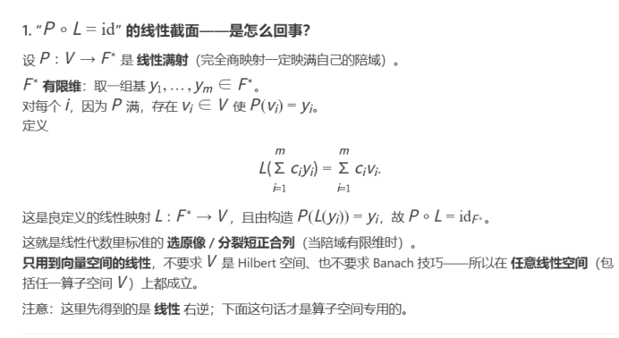
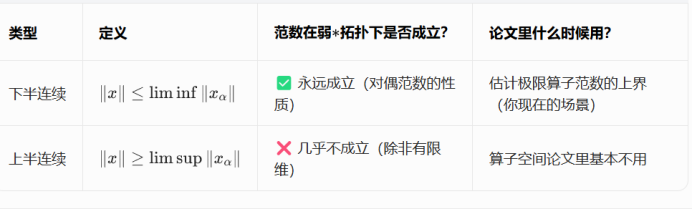

# 线性截面（右逆）与弱*拓扑下范数的半连续性

> 来源：用户自制讲义/笔记截图整理入库（无单一第三方网页原文；原件 PNG 见 `./assets/functional-analysis-notes/`）。
> 作者：用户整理
> 发布日期：不适用
> 收录日期：2026-05-05

本文归档两张截图中的要点：**满射线性映射的线性右逆（截面）构造**，以及 **弱*收敛情形下对偶范数的下半连续与上半连续** 的经验对照表。可在算子空间、对偶空间与短正合列分裂的讨论中作为备忘。

---

## 1. 「$P \circ L = \mathrm{id}$」的线性截面

**设定：** 设 $P : V \to F^*$ 为 **线性满射**，且 **$\dim F^* < \infty$**。商映射总是映满陪域，是常见的满射实例。

**构造步骤：**

1. 在 $F^*$ 中取一组基 $y_1,\ldots,y_m$。
2. 对每个 $i$，由 $P$ 的满射性，存在 $v_i \in V$ 使得 $P(v_i)=y_i$（任选一组原像）。
3. 定义 $L : F^* \to V$：对任意系数 $c_i$，
   $$
   L\Big(\sum_{i=1}^m c_i y_i\Big) = \sum_{i=1}^m c_i v_i.
   $$

**结论：** 上述 $L$ 良定义且线性；且 $P(L(y_i))=y_i$，因而 **$P \circ L = \mathrm{id}_{F^*}$**。这就是线性代数里标准的「对陪域基向量选原像再线性延拓」，也即 **短正合列分裂** 的典型操作方法（陪域有限维时总能这样做）。

**适用范围：** 论证 **仅用到向量空间的线性结构**，不要求 $V$ 为 Hilbert 空间，也不需要 Banach 空间技巧；因此对任意线性空间（包括一般的算子空间 $V$）都成立。此处得到的是 **线性** 右逆；若还需连续性、完全正性等额外结构，则要另作讨论。

---

## 2. 弱*拓扑与范数：下半连续 vs 上半连续

下表与上图一致，便于检索与 diff。

| 类型 | 定义（沿网或序列） | 范数在弱*拓扑下是否典型成立 | 论文中的常见用途 |
|------|-------------------|----------------------------|------------------|
| **下半连续** | $\|x\| \le \liminf_\alpha \|x_\alpha\|$ | ✅ 通常恒成立（与 **对偶范数** 的性质相应） | **估计极限元的范数上界**（例如极限算子范数的上界） |
| **上半连续** | $\|x\| \ge \limsup_\alpha \|x_\alpha\|$ | ❌ 一般 **不**成立（有限维情形除外） | 算子空间相关文献里 **很少** 指望弱*收敛配合范数上半连续 |

**读表要点：** 弱*极限常常只能稳妥地使用 **$\|\cdot\|$ 的下半连续性**，从而得到 $\|\text{极限}\| \le \liminf \|\cdot\|$；若要反向控制范数（类似上半连续），往往需要额外假设（如有限维、或改用别的拓扑/紧性论证），不可默认成立。

---

## 使用提示

- 将「线性截面」与「短正合列分裂」对照阅读时，记住关键是 **陪域有限维** 保证基的有限性与原像选取的可行性。
- 在读弱*收敛论证时，先确认作者用的是 **$\liminf$ 方向的不等式**（下半连续）还是错误地假设了 **$\limsup$**（上半连续）；后者在无额外假设时极易不成立。
